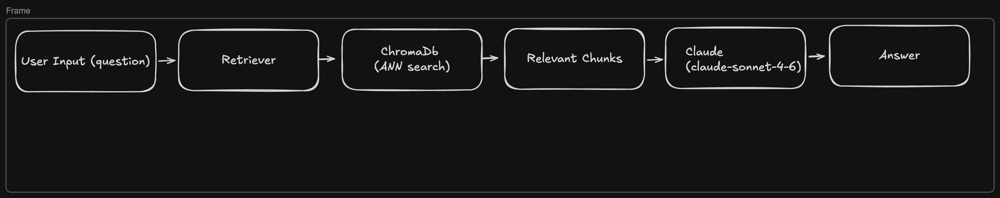

# SEC RAG — JPMorgan 10-K QA System

A retrieval-augmented generation system for querying JPMorgan Chase's 10-K SEC filing. Built with LangGraph, Cohere reranking, ChromaDB, and Claude.

**Live demo:** https://huggingface.co/spaces/rheaupadhyay/sec-rag

---

## Stack

- **LLM:** Claude (Anthropic)
- **Orchestration:** LangGraph (query rewriting)
- **Reranking:** Cohere
- **Vector store:** ChromaDB
- **Embeddings:** Sentence Transformers
- **Frontend:** Streamlit
- **Deployment:** HuggingFace Spaces (Docker)

---

## Architecture



## Evaluation

Evaluated using RAGAS on 10 questions: 5 answerable from indexed data, 5 outside the indexed excerpt.

---

### Phase 1 — No query rewriting, no reranking

| Metric | Answerable | Unanswerable |
|--------|-----------|--------------|
| Faithfulness | 1.000 | 0.893 |
| Answer Relevancy | 0.765 | 0.000 |
| Context Precision | 0.500 | 0.628 |
| Context Recall | 0.800 | 0.800 |

Findings

**Faithfulness (0.893 unanswerable):** Fallback instruction works but 
model occasionally adds unsupported suggestions (e.g. "refer to capital 
management section"). Its not in retrieved context — genuine faithfulness 
failure. Fix is to add stricter fallback instruction.

**Answer Relevancy (0.0 unanswerable):** This is because some fallback answers 
reference what IS in the document rather than addressing the question. 
This is a known RAGAS limitation on fallback responses, not a model failure.

**Context Precision (0.50 answerable):** Retrieved chunks contain 
significant irrelevant content. 500 token chunks are probably too large. This means relevant 
information shares chunks with noise. 

**Context Recall (0.0 — business segments):** Retrieval failure on an 
answerable question. Segment information exists in indexed data but 
ChromaDB probably returned wrong chunks. This is likely caused by chunking splitting 
the segment description across chunk boundaries.

Limitations
- Scores have run-to-run variance due to LLM-based evaluation
- Unanswerable ground truths artificially influence recall scores
- 100KB truncation excludes financial statements — revenue, capital 
  ratios, and income figures are not evaluable from this dataset

### Phase 2 — LangGraph query rewriter, no reranking

| Metric | Answerable | Unanswerable | Overall
|---|---|---|----|
| Faithfulness | 0.800 | 0.920 | 0.860
| Answer Relevancy | 0.771 | 0.000 | 0.385
| Context Precision | 0.533 | 0.500 | 0.517
| Context Recall | 0.800 | 0.800 | 0.800

### Per Question breakdown
| Question | Faithfulness | Answer Relevancy | Context Precision | Context Recall | Answerable |
|---|---|---|---|---|---|
| Where is JPMorgan Chase headquartered? | 1.00 | 0.986 | 1.000 | 1.0 | Yes |
| What is JPMorgan Chase's ticker symbol and on which exchange does it trade? | 0.50 | 0.940 | 0.333 | 1.0 | Yes |
| What are JPMorgan Chase's three reportable business segments? | 0.50 | 0.000 | 0.000 | 0.0 | Yes |
| How many employees does JPMorgan Chase have globally? | 1.00 | 0.927 | 1.000 | 1.0 | Yes |
| What were JPMorgan Chase's total assets as of December 31, 2025? | 1.00 | 1.000 | 0.333 | 1.0 | Yes |
| What is JPMorgan Chase's net interest income for 2025? | 1.00 | 0.000 | 0.639 | 1.0 | No |
| What is JPMorgan Chase's CET1 capital ratio? | 1.00 | 0.000 | 0.806 | 1.0 | No |
| Who is the CEO of JPMorgan Chase? | 1.00 | 0.000 | 0.000 | 0.0 | No |
| What is JPMorgan Chase's total revenue for 2025? | 1.00 | 0.000 | 0.417 | 1.0 | No |
| What is JPMorgan Chase's return on equity? | 0.60 | 0.000 | 0.639 | 1.0 | No |

Note: Answer Relevancy is 0.0 for unanswerable questions by design — the model correctly responds with "I don't have that information" which RAGAS scores as irrelevant.

### Phase 3 — LangGraph query rewriter + Cohere reranking

| Metric | Before | After | Change |
|---|---|---|---|
| Faithfulness | 0.860 | 0.930 | +0.070 |
| Answer Relevancy | 0.385 | 0.387 | ~flat |
| Context Precision | 0.517 | 0.642 | +0.125 |
| Context Recall | 0.800 | 0.800 | flat |

Reranking improved context precision (+0.125) and faithfulness (+0.070), which means that the chunks passed to Claude became more relevant and the answers stayed closer to the source document.

Context recall was unaffected — reranking reorders existing chunks but doesn't retrieve new ones, so coverage stayed the same.

Answer relevancy remained flat as well. For answerable questions it was essentially unchanged (0.771 → 0.773). The unanswerable questions continue to score 0 by implementation, dragging the overall average down regardless of retrieval quality.

Q2 (business segments) continues to fail on both context precision and recall — this is likely a document coverage issue, not a retrieval issue. The relevant content may not be present in the indexed excerpt. (Still need to test with varying chunks, and overlap)

| Answerable | Faithfulness | Answer Relevancy | Context Precision | Context Recall |
|---|---|---|---|---|
| Yes | 0.900 | 0.773 | 0.700 | 0.800 |
| No | 0.960 | 0.000 | 0.583 | 0.800 |


### Phase 4 — Chunk size experiment

| Metric | Baseline (500/50) | 256/26 | 512/51 | 1024/102 |
|---|---|---|---|---|
| Faithfulness | 0.930 | 0.982 | 0.955 | 1.000 |
| Answer Relevancy | 0.387 | 0.490 | 0.385 | 0.434 |
| Context Precision | 0.642 | 0.850 | 0.700 | 0.850 |
| Context Recall | 0.800 | 0.900 | 0.800 | 0.900 |

Chunk Size Tradeoffs

Small chunks (256): retrieval is enhanced and precise, but more chunks passed to LLM increases middle problem risk (performs worse if context is in the middle)
Medium chunks (512): worst of both worlds in this dataset — splits content across boundaries losing context and necessary overlap
Large chunks (1024): less precise retrieval but richer context per chunk, this increases faithfulness

Final config: 1024/102 — prioritize faithfulness, which is the critical metric for a SEC filing assistant.
---

### Known Limitations

- RAGAS scores have run-to-run variance due to LLM-based evaluation
- Unanswerable ground truths artificially suppress recall scores
- Indexed excerpt is 100KB — financial statements (revenue, capital ratios, income) are not evaluable from this dataset
- Business segments question fails on both precision and recall — likely a document coverage issue, not a retrieval issue

## Setup

```bash
git clone https://huggingface.co/spaces/rheaupadhyay/sec-rag
cd sec-rag
python -m venv venv && source venv/bin/activate
pip install -r requirements.txt
export ANTHROPIC_API_KEY=your_key
export COHERE_API_KEY=your_key
streamlit run app.py
```

---

## Environment

- Python 3.11 (via Dockerfile — `runtime.txt` is ignored by HF Spaces)
- Secrets: `ANTHROPIC_API_KEY`, `COHERE_API_KEY` set as HF Space secrets
- Vector store builds at runtime — `chroma_db/` is not committed
